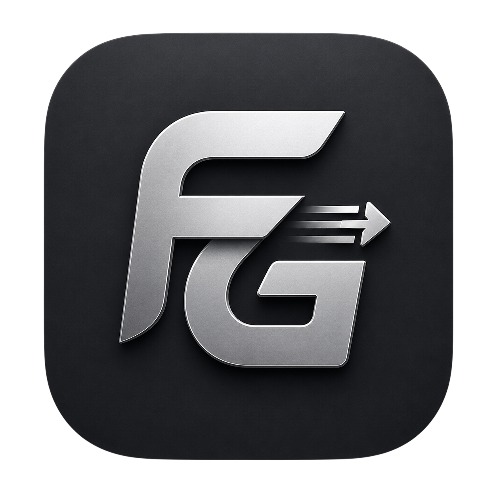
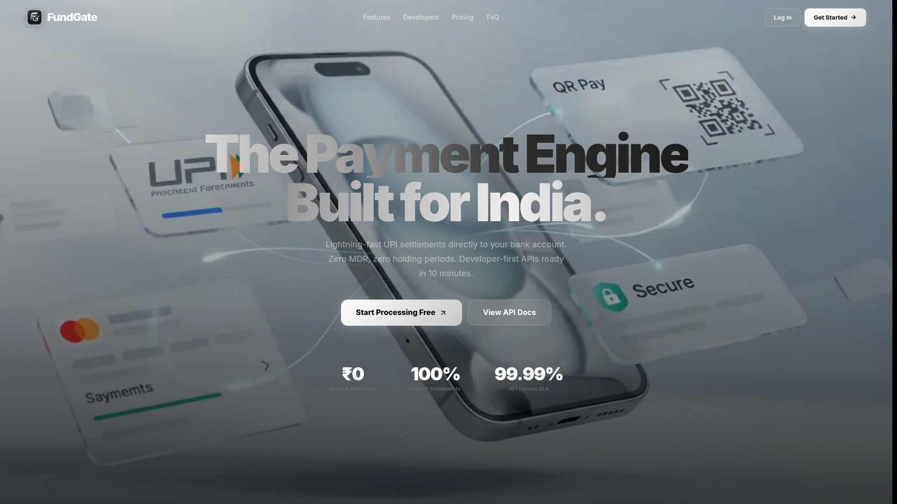
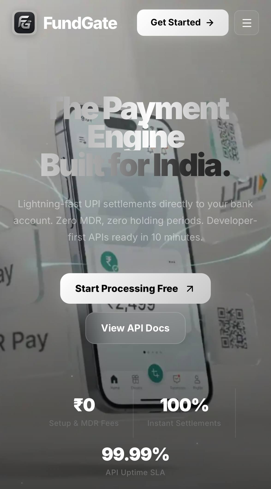

 

<table border="0" cellspacing="0" cellpadding="0" align="center">
<tr>
<td valign="middle"></td>
<td valign="middle"><h1 style="margin:0; padding-left:12px;">FundGate</h1></td>
</tr>
</table>

 

 

 

 

<table border="0" cellspacing="0" cellpadding="0" width="100%">
  <tr>
    <td width="75%" align="center"><b>🖥️ &nbsp;Desktop</b></td>
    <td width="25%" align="center"><b>📱 &nbsp;Mobile</b></td>
  </tr>
  <tr>
    <td width="75%" valign="top" align="left">
      
    </td>
    <td width="25%" valign="top" align="right">
      
    </td>
  </tr>
  <tr>
<td colspan="2" align="center">
   
  
    ✦ <b>Fully Responsive UI/UX</b> — Pixel-perfect on every screen: Desktop, Tablet &amp; Mobile
      
    🌐 <a href="https://fundgate.mazid.dev"><b>Visit FundGate →</b></a>
  
</td>
  </tr>
</table>

 

---

## Overview

**FundGate** is a developer-first UPI payment gateway built exclusively for the Indian market. It provides merchants and developers with simple, secure, and reliable APIs to accept payments — designed to simplify UPI payment integration for developers and businesses.

India's payment landscape is growing at an unprecedented pace, yet most payment solutions are built for enterprises, not developers. FundGate bridges that gap — giving indie developers, startups, and small businesses a clean, modern payment infrastructure designed for fast integration with clear documentation and modern APIs.

FundGate provides a unified REST API for creating payment orders, verifying transactions, generating public payment links, and enabling QR-based checkout. Merchants connect their supported payment provider account, while FundGate focuses on delivering a clean developer experience, transparent subscription pricing, and comprehensive documentation.

> FundGate is purpose-built for developers who want to move fast, ship clean, and get paid — in India.

 

---

### 🔗 Quick Links

| | Resource | Description |
|---|---|---|
| 📖 | [About FundGate](https://fundgate.mazid.dev/about) | Learn what FundGate is and the story behind it |
| 📚 | [Documentation](https://fundgate.mazid.dev/docs) | Full API reference, guides, and integration docs |
| 🛡 | [Security](https://fundgate.mazid.dev/security) | How we protect your data and transactions |
| 📄 | [Privacy Policy](https://fundgate.mazid.dev/privacy) | How we collect and handle your information |
| 📜 | [Terms of Service](https://fundgate.mazid.dev/terms) | Usage terms and conditions |
| 💳 | [Refund Policy](https://fundgate.mazid.dev/refund) | Refund and dispute resolution policy |
| 📬 | [Contact](https://fundgate.mazid.dev/contact) | Get in touch with the team |
| 🌐 | [Connect](https://fundgate.mazid.dev/connect) | Find us on social platforms |
| 🐞 | [Report a Bug](https://fundgate.mazid.dev/report-bug) | Help us improve by reporting issues |

---

## ⚡ Features

 

### 🔌 Payment APIs

| Feature | Description |
|---|---|
| **Create Order API** | Programmatically generate payment orders with amount, metadata, and callback configuration |
| **Verify Payment API** | Cryptographically verify transaction status with server-side signature validation |
| **Public Payment Links** | Share a payment URL anywhere — no code required for the payer |
| **QR Scan & Pay** | Auto-generated QR codes for every payment request, scannable by any UPI app |

 

### 💸 UPI Apps Supported

| App | Status |
|---|---|
| **Google Pay** | ✅ Supported |
| **PhonePe** | ✅ Supported |
| **Paytm** | ✅ Supported |
| **UPI-compatible Apps** | ✅ Supported via standard UPI deeplinks |

 

### 🏦 Settlement & Merchant Tools

| Feature | Description |
|---|---|
| **Direct Settlement** | Funds settle directly to your registered bank account |
| **Merchant Dashboard** | Manage payments, view transactions, and configure your account. |
| **Developer Dashboard** | Manage API integrations and developer settings. |
| **API Keys** | Create and manage API keys for your integrations. |

 

### 🔐 Auth & Access

| Feature | Description |
|---|---|
| **Google OAuth** | One-click sign-in with Google — no passwords required |
| **Cloudflare Turnstile** | Bot-proof CAPTCHA for every sensitive form |
| **Subscription Plans** | Flexible tier-based pricing to suit every scale |
| **Free Trial** | Get started without a credit card |

---

## 🛠 Tech Stack

 

 

| Layer | Technology | Version | Purpose |
|---|---|---|---|
| **Framework** | [Next.js](https://nextjs.org) | 16.x | Full-stack React framework with App Router |
| **UI Library** | [React](https://react.dev) | 19.x | Component-based declarative UI |
| **Styling** | [Tailwind CSS](https://tailwindcss.com) | v4 | Utility-first CSS framework |
| **Animation** | [Framer Motion](https://www.framer.com/motion/) | 12.x | Production-grade motion library |
| **HTTP Client** | [Axios](https://axios-http.com) | 1.x | Promise-based HTTP requests |
| **Charts** | [Recharts](https://recharts.org) | 3.x | Composable charting for dashboards |
| **Security** | [Cloudflare Turnstile](https://developers.cloudflare.com/turnstile/) | — | Bot detection & CAPTCHA replacement |
| **Auth** | [Google OAuth](https://developers.google.com/identity) via `@react-oauth/google` | — | Social sign-in authentication |
| **Animations** | [Lottie / DotLottie](https://dotlottie.io) | — | JSON-based micro-animations |
| **Icons** | [Lucide React](https://lucide.dev) | 1.x | Clean, consistent icon set |
| **Notifications** | [React Hot Toast](https://react-hot-toast.com) | 2.x | Lightweight toast notifications |
| **State** | [Context API](https://react.dev/reference/react/useContext) | — | Global state management |

---

## 🔒 Security Architecture

 

| 🔐 Control | Description |
|---|---|
| **HTTPS / TLS** | All traffic encrypted in transit via TLS 1.2+ |
| **API Authentication** | API endpoints require valid authentication credentials. |
| **API Keys** | API keys are used to authenticate merchant integrations. |
| **Google OAuth** | Delegated authentication via Google's identity platform |
| **Cloudflare Turnstile** | Invisible bot protection on all public-facing forms |
| **Webhook Verification** | Webhook verification is supported where applicable. |
| **Privacy First** | Minimal data collection — only what is strictly necessary |

 

---

## 🛡️ Responsible Disclosure

 

> [!IMPORTANT]
> FundGate helps merchants accept real UPI payments. Because financial applications require strong security, we welcome responsible vulnerability disclosures from ethical security researchers. If you discover a security issue, please report it privately so we can investigate and resolve it promptly.

 

### What We Welcome

| 🔍 Scope | Examples |
|---|---|
| **Authentication & Session** | OAuth flaws, session fixation, token leaks |
| **API Security** | Broken access control, IDOR, injection attacks |
| **Payment Flow** | Order tampering, payment bypass, race conditions |
| **Data Exposure** | Sensitive data leaks, misconfigured endpoints |
| **Infrastructure** | Subdomain takeover, open redirects, misconfigurations |

 

### Ground Rules

> [!CAUTION]
> **Do NOT** exploit, modify, delete, or exfiltrate any real user data.
> **Do NOT** perform attacks that affect availability (DDoS, stress testing).
> **Do NOT** disclose vulnerabilities publicly before we have patched them.
> **Do NOT** test against accounts you do not own.

 

✅ **If you find something — please report it responsibly:**

- Do **not** misuse it in any way
- Do **not** share it publicly
- **Contact us privately** and we will acknowledge and fix it promptly

 

### 📬 Report a Vulnerability

| Channel | Contact |
|---|---|
| 📧 **Email** | [support@mazid.dev](mailto:support@mazid.dev) |
| 💬 **Telegram DM** | [@mazid_gmr](https://t.me/mazid_gmr) |
| 🐞 **Bug Report Form** | [fundgate.mazid.dev/report-bug](https://fundgate.mazid.dev/report-bug) |

 

> Security reports are reviewed promptly. Valid and responsibly disclosed findings may be acknowledged, and reporters may be credited with their permission.

---

## 🌐 Website Navigation

 

| Page | URL | Description |
|------|-----|-------------|
| Home | [fundgate.mazid.dev](https://fundgate.mazid.dev) | Landing page |
| About | [/about](https://fundgate.mazid.dev/about) | Project story and mission |
| Documentation | [/docs](https://fundgate.mazid.dev/docs) | Integration guides & API reference |
| Register | [/register](https://fundgate.mazid.dev/register) | Create a merchant account |
| Login | [/login](https://fundgate.mazid.dev/login) | Merchant sign-in |
| Dashboard | [/dashboard](https://fundgate.mazid.dev/dashboard) | Manage payments, API keys, and account settings |
| Privacy Policy | [/privacy](https://fundgate.mazid.dev/privacy) | Data privacy information |
| Terms of Service | [/terms](https://fundgate.mazid.dev/terms) | Usage terms |
| Refund Policy | [/refund](https://fundgate.mazid.dev/refund) | Refund & dispute resolution |
| Contact | [/contact](https://fundgate.mazid.dev/contact) | Reach the team |
| Connect | [/connect](https://fundgate.mazid.dev/connect) | Social & community links |
| Report a Bug | [/report-bug](https://fundgate.mazid.dev/report-bug) | Submit an issue |

---

## 🤝 Community

 

 

> Have a question? Found a bug? Want to collaborate?
> <a href="https://fundgate.mazid.dev/contact"><strong>Visit our Contact page →</strong></a>

---

## 👤 About the Creator

 

**Mazid** — Independent Developer & B.Tech Computer Science Student

Founder of **[MazidSpace](https://mazid.dev)** · Building tools that empower developers across India.

 

---

## 📄 License & Source Code

 

> [!IMPORTANT]
> **This repository contains documentation and public-facing resources only.**
> The documentation in this repository is publicly available. The FundGate production software is proprietary and is not open source. Unauthorized copying, redistribution, or reverse engineering of the proprietary software is prohibited.

 

© 2026 FundGate · [MazidSpace](https://mazid.dev) · All rights reserved.

---

Built with ❤️ in **India** · Powered by **MazidSpace** · Secured by **Cloudflare**

